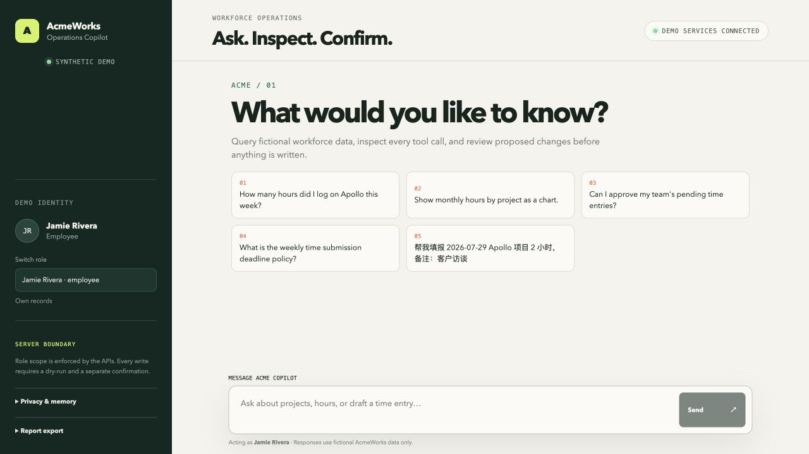
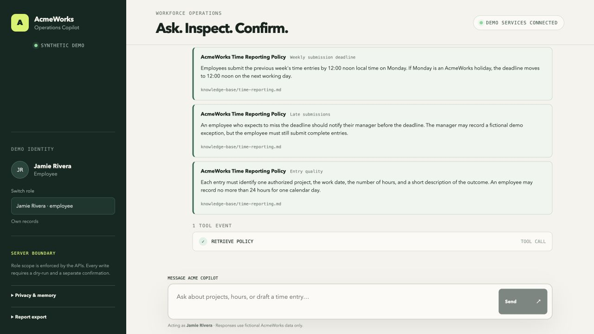
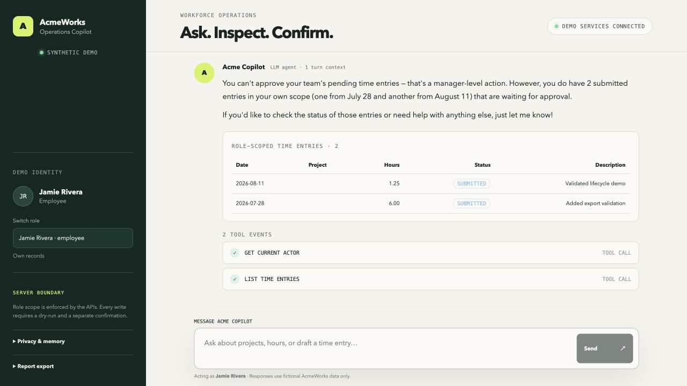
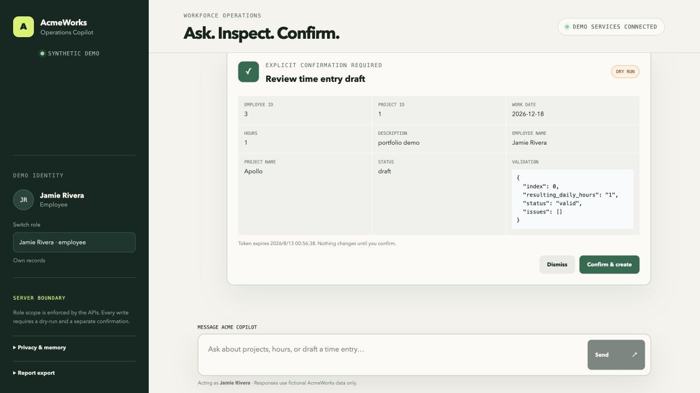
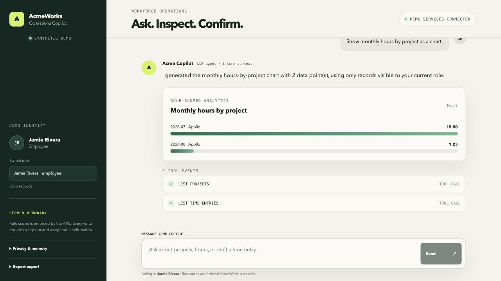

# Workforce Operations Copilot

**A review-first AI automation demo for small and growing teams.** It turns
plain-language workforce requests into role-scoped reads, grounded answers,
and inspectable write proposals—without letting a model silently change
business records.

The business problem is simple: internal operations requests arrive in
unstructured language, but the resulting access decisions and writes still
need to be correct, reviewable, and easy to hand over. This project shows how
to connect those two worlds with a complete web app, API boundary, audit trail,
tests, and local deployment path.



## See the value in 60 seconds

| Demo path | Try this | What it proves |
| --- | --- | --- |
| Grounded policy answer | `What is the weekly time submission deadline policy?` | The answer includes inspectable fictional policy sources instead of unsupported model text. |
| Permission boundary | As Jamie, ask `Can I approve my team's pending time entries?` | The employee is refused the manager action while still receiving useful, role-scoped information. |
| Review-first write | `Draft 1 hour on Apollo for 2026-12-18, description: portfolio demo` | The system returns a dry-run and server-issued confirmation step; nothing is written before a separate click. |
| Simulated SMB integration | Open `Simulated Calendar review`, load the fictional event, prepare and confirm it, then open `Simulated Slack preview` | The full integration lifecycle works without external accounts; duplicate input cannot create a second time entry. |

▶ [Watch the 80-second product walkthrough](https://github.com/lh229470989/workforce-operations-copilot/releases/download/portfolio-demo-v1/workforce-operations-copilot-demo.webm)
or [open the recording script and shot list](docs/portfolio-demo.md).

For client-facing packaging, see the paste-ready
[Upwork SMB AI Automation project package](docs/upwork-project-package.md).

## What a client can verify

- **Natural language to workflow:** policy lookup, role-scoped reporting,
  structured analytics, exports, and time-entry lifecycle actions.
- **Visible safety boundaries:** employee, manager, and admin scopes are
  enforced server-side; writes require dry-run, expiring confirmation token,
  re-authorization, and an audit record.
- **Inspectable integration surface:** FastAPI services, server-side Next.js
  proxying, MCP 2.0 Streamable HTTP, health endpoints, and Docker Compose.
- **Reusable automation templates:** two disabled, credential-free n8n `2.34.6`
  workflows cover read-only Calendar ingest and claim-before-send Slack delivery;
  the public UI runs only their explicitly labeled mock equivalent.
- **Delivery evidence:** 120 authored Agent/RAG/security benchmark cases,
  Python and React tests, Playwright browser checks, container builds,
  dependency audit, and publication security scan in CI.
- **Measurable operation:** request ID, route, status, latency, intent, and tool
  metadata are observable without logging chat messages or actor attributes.

The bounded scale is intentional: three synthetic personas, preview-only MCP
writes, up to 10 atomic time-entry drafts, and up to 20 atomic manager
decisions. These limits make the demo auditable rather than pretending to be
an unrestricted production platform.

## Product evidence

| Grounded answers | Role-aware refusal |
| --- | --- |
|  |  |
| Review-first write | Role-scoped analytics |
|  |  |

The responsive welcome experience is also verified at `390 × 844`:
[view the mobile screenshot](docs/assets/portfolio/06-mobile-welcome.jpg).
All people, organizations, policies, projects, and records shown here are
fictional.

## My implementation scope

I designed and implemented this standalone showcase end to end: product and
safety boundaries, synthetic data model, FastAPI Core and AI services,
LangGraph orchestration, grounded retrieval, write-confirmation protocol,
MCP server, Next.js interface, observability, evaluations, tests, containers,
CI, and documentation. It is a fresh portfolio codebase, not a copy of an
employer or client system.

## Run the demo

```bash
cp .env.example .env
docker compose up --build
```

Then open:

- Web workspace: `http://localhost:3000`
- AI API documentation: `http://localhost:8000/docs`
- Demo Core API documentation: `http://localhost:8001/docs`
- MCP endpoint: `http://localhost:8002/mcp`

Set `OPENAI_API_KEY` in `.env` to use the configured model. Without a key, the
stack remains usable as an explicitly labeled `local fallback`; deterministic
routing is never presented as model output. More detail is in the
[local development guide](docs/local-development.md).

## Implemented capabilities

- Cited answers over original fictional workforce policies.
- Role-scoped employee, project, time-entry, approval, report, and analytics reads.
- Reviewable suggestions derived from a user's recent fictional work.
- Dry-run and explicit confirmation for create, batch create, edit, delete,
  submit, withdraw, approve, reject, preference, and structured-memory writes.
- Atomic scope validation for batches and duplicate/cumulative-hours checks at
  both preview and confirmation.
- Structured tables, cards, charts, CSV/XLSX/PDF exports, live SSE progress,
  and metadata-only admin audit views.
- Actor-bound short sessions, privacy controls, bounded history, explicit
  memories, and hot-reloadable knowledge documents.
- Read/resource/prompt MCP operations plus preview-only write tools.
- Simulated Calendar → suggestion → confirmation → Slack-preview browser path,
  plus two import-validated n8n templates for private test environments.

## Architecture and trust boundary

```text
Next.js web → FastAPI AI API → LangGraph tools / retrieval / policy checks
                                      ↓
MCP client → AcmeWorks MCP ───→ Demo Core API + SQLite
             preview only       authorization + confirmation + audit
```

The browser and the model are not authorization boundaries. Every protected
operation is checked by the Core API. A write proposal does not become a write
unless the user separately submits its actor-bound token and the server
rechecks authorization and business rules.

Start with the [documentation index](docs/README.md), or go directly to:

- [System overview](docs/system-overview.md)
- [Agent runtime and model call chain](docs/agent-runtime.md)
- [Permissions, security, and context](docs/security-and-context.md)
- [MCP and connectors](docs/mcp-and-connectors.md)
- [Evaluation method](docs/evaluation.md)
- [Observability](docs/observability.md)

## Verification

```bash
python3 scripts/security_scan.py
python3 scripts/scan_n8n_templates.py

cd services/demo-core-api && pytest
cd services/ai-api && pytest
cd services/acmeworks-mcp && pytest
cd apps/web && npm test && npm run typecheck && npm run build
cd apps/web && npm run test:e2e

docker compose up --build -d
docker compose ps
```

CI runs the publication scan, dependency audit, all service and web tests,
production build, container build, and browser E2E suite. Operational endpoints
include `/health`, `/ready`, `/observability`, and `/metrics`.

## Known limits

- The included workforce system and all data are synthetic.
- This repository currently has no hosted public URL. Its public-mode integration
  is simulated; real Google Calendar and Slack execution is reserved for an
  isolated private test environment and has not yet been published as evidence.
- Authentication is represented by switchable demo personas, not production
  OIDC/SSO or multi-tenant identity.
- MCP write tools stop at preview; confirmation stays in the trusted application.
- Public LLM access is intentionally not offered without budget and abuse controls.

The next evidence-led phases are tracked in the
[SMB AI automation portfolio roadmap](docs/portfolio-roadmap.md). Release and
publication controls are documented in [SECURITY.md](SECURITY.md) and the
[release checklist](docs/release-checklist.md).

## License

Released under the [MIT License](LICENSE).
