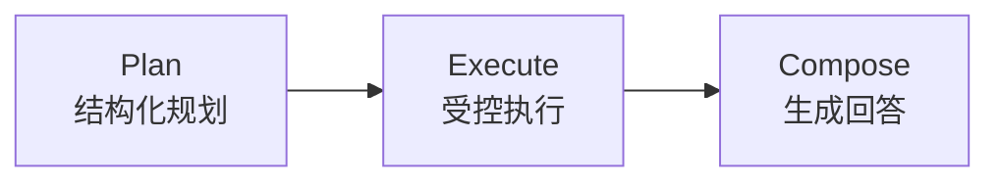
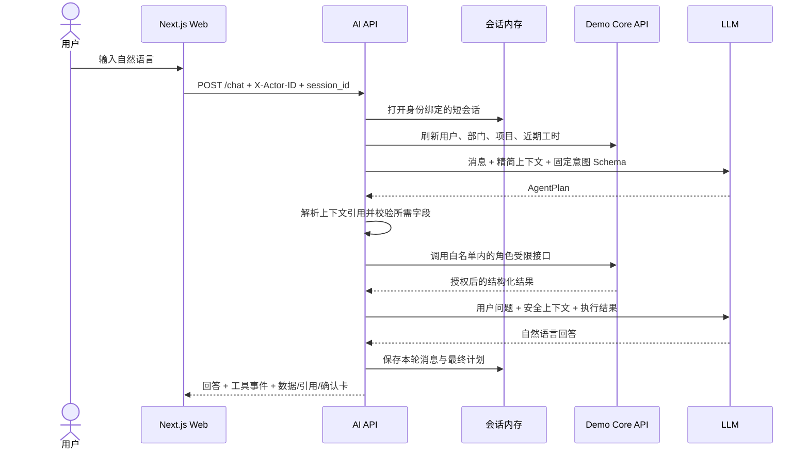
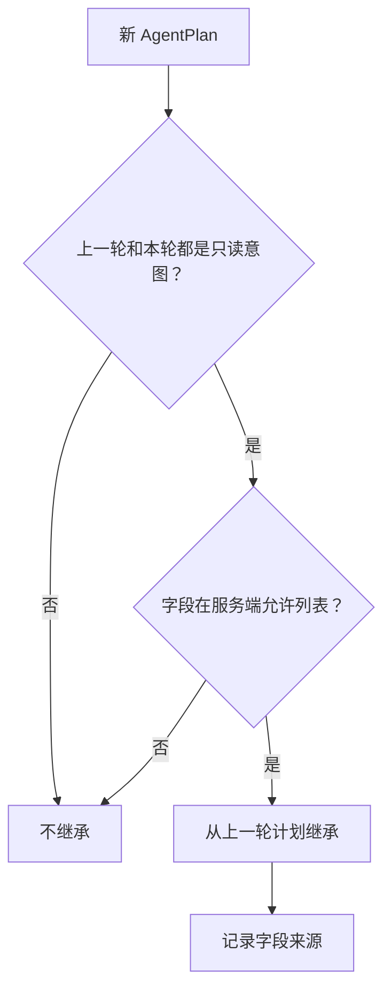

# Agent 运行时架构

## 核心原则

当前 Agent 是“模型负责语义、服务负责执行”的结构。LLM 不直接访问 SQLite、Core API 或任意网络工具，也不能仅通过生成一句话让系统认定操作已经成功。

LangGraph 当前包含三个顺序节点：

图结构目前故意保持简单。安全性主要来自结构化计划、工具白名单、Core API 权限和两阶段写入，而不是来自复杂的 Agent 循环。

## 一次聊天请求的时序

当计划属于问候或普通聊天时，可以不调用 Core 业务工具，但请求开始时仍会刷新可信用户上下文。这样后续转入业务问题时不会依赖模型记住角色。

## SSE 进度事件

`POST /chat/stream` 使用 LangGraph 的节点更新流依次发送：

- `status`：planning、executing、composing；
- `tool`：完成的白名单工具名称和状态；
- `result`：与普通 `/chat` 相同的完整结构化响应；
- `done`：正常结束标记。

中间事件不发送工具输入输出、员工数据或 confirmation token。Next.js 只做
字节流代理，浏览器在收到最终 `result` 后才渲染业务数据和确认卡。普通 JSON
端点继续保留给兼容客户端和简单集成。

## 多工具只读计划

`compare_analysis` 是受限多步骤计划，而不是开放式工具循环。规划器只能给出
2–4 个 `AnalysisStep`，每项包含展示标签以及可选项目、日期和状态过滤。服务端
先解析所有项目并验证全部日期、标签和角色可见范围；只有整份计划有效时才逐项
执行 `list_time_entries`。结果由应用代码计算总工时和相对首项的差值。

此 Schema 没有函数名、SQL、写操作或 confirmation 字段，所以模型无法把工时
草稿或审批混入比较计划。任何越权项目都会在数据查询前终止整份计划。

相对日期统一根据 `BUSINESS_TIMEZONE` 计算，而不是使用容器 UTC 日历。这样
“今天/本周/上周”、智能建议和周报在业务时区跨午夜时仍指向同一日期范围。

## Prompt 版本

规划与回答 Prompt 位于 `services/ai-api/prompts/`。manifest 固定文件名、语义
版本和 SHA-256，启动时由 `PromptRegistry` 校验；内容漂移会让服务拒绝启动。
健康端点只公开版本号。升级需要新建不可变版本文件、更新摘要、运行评估与真实
模型 smoke test；回滚则把 manifest 指回已评审版本。

## 结构化规划

规划器输出 Pydantic `AgentPlan`，主要包含：

- `intent`：从固定意图集合中选择一项。
- 项目、日期、状态、工时、描述等可选参数。
- `conversation_relation`：本轮是否细化上一轮或切换查询主体。
- `inherit_fields`：明确声明希望从上一轮继承的只读字段。
- `project_reference`：例如引用可信上下文中的近期项目。

模型不能增加一个未注册的工具。计划进入执行阶段后，应用代码只会分派到固定的读取注册表、政策检索、个人填报建议、工时 dry-run 或单记录审批 dry-run 分支。

## 上下文解析

对“那上个月呢”这类追问，模型声明对上一轮的关系，服务端再决定是否允许继承：

允许继承的字段目前只有项目、工时状态和日期范围。工时草稿缺失的项目、日期、小时或描述不会从旧对话自动补齐，避免把模糊追问变成写操作参数。

## 工具执行与结果约束

读取工具通过 `ReadQueryRegistry` 注册，包括身份、部门、员工、项目、项目成员、工时、汇总、月度图表和待审批查询。个人填报建议同样由 Core API 根据当前 actor 的近期工时和有效项目成员关系生成。每次调用都会携带当前 actor ID，由 Core API 返回该角色可见的数据。

执行结果统一为 `ExecutionResult`，其中可以包含：

- 安全的回退回答；
- 工具事件及其结构化输入输出；
- 页面需要展示的数据；
- 政策引用；
- dry-run 确认卡。

回答生成器只能基于这个执行结果组织语言。提示词明确要求保留拒绝、零结果和 dry-run 状态，不得补造员工、项目、工时、政策或动作结果。

批量草稿只接受当前消息中明确给出的每一项项目、日期、小时和描述，最多
10 项。AI API 先逐项解析项目，再请求一个批量 dry-run；Core API 校验全部
项目成员关系后返回一个确认 token。真正确认时会再次鉴权，并在单个事务中
写入整个批次。

审批规划必须从当前消息解析精确 `time_entry_id` 和 `approved`/`rejected`
决定；旧会话不会补齐这两个字段。资格问题只调用待审批读取工具。审批 dry-run
和最终确认都会由 Core API 检查角色、直属关系、submitted 状态以及禁止自批。

## LLM 模式与本地降级

`AI_MODE=auto` 是默认配置：

| 条件 | 规划 | 回答 |
| --- | --- | --- |
| 已配置 `OPENAI_API_KEY` | LLM 结构化规划 | LLM 基于授权结果生成 |
| 未配置密钥 | 确定性本地规划器 | 确定性安全回答 |
| `AI_MODE=openai` 但无密钥 | 服务启动失败 | 不会静默伪装成 LLM |

页面用 `LLM agent` 或 `local fallback` 显示真实模式。本地降级用于离线演示和回归测试，不等价于开放式大模型对话。

两次模型调用使用同一个 Responses API 兼容客户端：第一次产生结构化计划，第二次产生最终回答。模型服务不可用时，回答生成会退回服务端已有的确定性结果；不会因为润色失败而让已授权查询整体不可用。

两阶段可以通过 `OPENAI_PLANNER_MODEL` 和 `OPENAI_COMPOSER_MODEL` 使用不同
模型；未配置时都继承 `OPENAI_MODEL`。这允许规划阶段选择结构化输出更稳定
的模型，而回答阶段选择延迟和成本更低的模型。

## 为什么不让模型直接调用确认接口

自然语言可能存在歧义，模型输出也不是用户授权凭据。因此 Agent 最多生成 dry-run，真正的确认由独立的 Web 请求完成。确认 token 在回答生成前会被移除，不发送给模型提供方。

这使“模型说已经提交”和“系统确实写入”成为两个严格不同的状态。只有 Core API 成功消费确认 token 并提交事务，系统才认为写操作完成。
