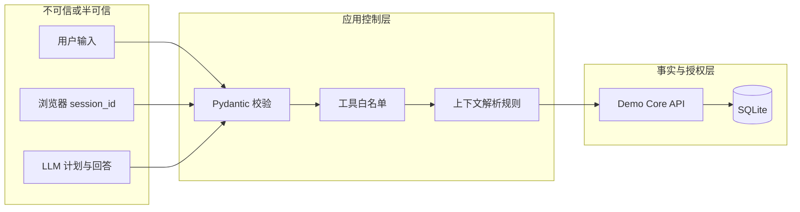
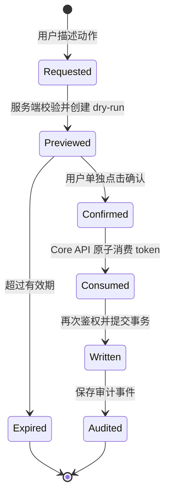

# 权限、安全与上下文

## 信任边界

系统把浏览器输入、会话 ID 和 LLM 输出都视为不可信数据。真正可信的业务事实来自 Core API 和 SQLite；真正的权限决定也由 Core API 完成。

## 角色权限

当前演示角色的核心范围如下。最终判定以 `demo-core-api` 服务端代码为准。

| 角色 | 读取范围 | 工时草稿 | 审批 |
| --- | --- | --- | --- |
| `employee` | 自己及自己参与的相关数据 | 只能为自己创建 | 不允许 |
| `manager` | 自己和直接下属的相关数据 | 只能为自己创建 | 只能决定直接下属的已提交工时，不能自批 |
| `admin` | 全部演示组织数据 | 可以为其他员工创建，但仍要求项目成员关系 | 可以决定已提交工时，仍不能自批 |

AI API 向对话 Agent 暴露读取能力、个人填报建议、单条或批量工时草稿
dry-run，以及单条工时的批准/驳回 dry-run。Agent 不能调用确认端点；确认
token 会在模型生成回答前移除。

## 写操作状态机

确认 token 具有以下约束：

- 绑定创建它的 actor；
- 有过期时间；
- 只能成功消费一次；
- 确认时重新检查角色、项目成员关系和记录状态；
- 批量写入最多 10 项，并以单一数据库事务保证全有或全无；
- 最终写入与审计事件在 Core API 中完成。

页面隐藏按钮、模型拒绝确认都只是额外保护，不能替代上述服务端约束。

## 上下文分层

系统没有把所有历史聊天直接当作事实，而是把上下文分为三层：

### 1. 权威用户上下文

每次 `/chat` 请求都会从 Core API 重新读取：

- 当前演示用户和角色；
- 当前可见部门；
- 当前可见项目；
- 最近可见工时记录。

角色或可见范围不会从旧消息推断，因此会话历史不能提升权限。

### 2. 短会话上下文

- 默认最多保留 10 轮；
- 默认 30 分钟滑动过期；
- 启动时和运行期间定期物理删除已过期会话及偏好操作提案；
- 保存在 AI API 专用 SQLite 中，普通重启后仍可恢复；
- session ID 绑定 actor，换身份复用会返回 403；
- 保存用户消息、助手回答和结构化计划。

LLM 回答生成只接收最近最多 6 轮，并只接收精简后的姓名、角色、职位、部门名称和近期项目名称，减少无关数据传输。

### 3. 持久偏好

只保存三个最小偏好：是否保留有期限的聊天历史、回答语言和常用项目 ID。
用户可查看当前值；修改、关闭历史和删除全部私有状态都要经过 dry-run 与绑定
actor 的显式确认。常用项目每次会重新匹配当前授权项目，失效或越权时不会进入
模型上下文。偏好只影响表达和上下文提示，不能改变角色、部门、项目范围或写操作。

“近期项目”仍来自每次刷新后的可信业务数据，不是模型自行形成的永久记忆。

智能填报建议也不是长期记忆或模型推测。它只复用当前 actor 自己最近记录
中的项目、小时和描述，并要求该 actor 仍是项目成员。建议是可编辑候选，不会
创建 PendingAction，也不会自动写入数据库。

## 发送给模型的数据

规划阶段接收用户消息、固定 Schema 和受限上下文。回答阶段接收用户问题、结构化计划、精简上下文和已经授权的执行结果。

回答阶段明确排除：

- confirmation token；
- 内部确认路径；
- 数据库连接信息；
- 服务端系统提示词之外的秘密；
- 未经 Core API 授权的组织数据。

SSE 中间事件进一步限制为阶段名称、已规划 intent、白名单工具名称和完成状态；
授权后的业务结果与 confirmation token 只出现在发给同一调用方的最终响应中。

周报 JSON 和 CSV 共用 Core API 的记录级范围查询。CSV 不是模型生成文本，
下载时会重新携带并校验当前演示 actor，因此页面中的链接本身不授予数据权限。

多工具比较的每个切片仍通过 Core API 记录级权限。应用层在执行前整体校验
2–4 个切片，避免后续越权项导致前面步骤已部分运行；比较计划只读且不能继承
任何写操作字段。

Prompt 不是运行时可编辑配置。容器只打包仓库内版本化文件，manifest 摘要在
启动期防止未评审漂移；健康检查公开版本但不公开 Prompt 内容。

模型调用设置 `store=false`，actor ID 会先经过单向哈希再作为安全标识使用。模型异常日志只记录异常类型，不记录提示词、聊天内容或业务载荷。

## 演示身份不是生产认证

`X-Actor-ID` 便于展示三种角色，但请求者可以在本地演示环境中切换它。因此这个仓库展示的是“授权规则如何分层实现”，不是完整的身份认证方案。

生产化时应由可信网关从登录凭据生成身份声明，后端不应接受浏览器任意选择 actor ID。同时应增加 CSRF 防护、速率限制、密钥托管、集中审计和数据库迁移管理。
