# SMB Calendar → Copilot → Slack 集成设计

状态：**设计已批准，Contracts 已完成，Ingest persistence 未开始**

版本：`v1-approved`

批准日期：2026-08-17

本文固定第二阶段的接口合同、安全边界、两个 n8n workflow、幂等、重试、
mock、测试账户和凭据策略。本文已通过设计评审，但在对应实现与测试完成前，
不得把这里的设计描述为已实现能力。

## 1. 客户问题与交付目标

中小企业经常希望把日历中的可计费或可填报工作转成工时，但 Calendar 事件是
外部、不完整且可重复投递的数据，不能直接成为业务写入。第二阶段要证明：

1. Google Calendar 的只读事件可以被转换成受限、可验证的工作建议；
2. 外部事件不会绕过现有的 Web 预览、显式确认、重新鉴权和审计边界；
3. 只有可信的确认成功结果可以触发 Slack 通知；
4. 重复事件、超时、限流、无效凭据和无效 payload 都有可恢复行为；
5. CI 不需要真实 Google、Slack 或 n8n 凭据也能验证完整合同。

## 2. 已确认决策

| 决策项 | v1 方案 |
| --- | --- |
| 输入平台 | Google Calendar，只读 |
| Google scope | 只申请 `https://www.googleapis.com/auth/calendar.readonly` |
| 通知平台 | Slack Incoming Webhook，只发送确认成功后的可信结果 |
| n8n 形态 | 发布两个可导入 JSON 模板，不托管公共 n8n |
| n8n 验证基线 | 锁定 `2.34.6`，模板在该版本导入、执行并重新导出 |
| 在线 Demo | 只运行 mock，并显示 `Simulated integration` |
| 真实集成 | 仅在私有测试环境和录制视频中展示 |
| 数据 | 仅使用虚构人员、项目、事件、工时和通知 |
| 凭据 | 不进入仓库、模板 JSON、CI、截图、视频或日志 |

Google Calendar 不被称为 sandbox。真实测试使用独立 Google 测试账号、独立
test-only Google Cloud project、独立 OAuth consent 配置和专用测试 Calendar。
Google 官方建议用独立 test-only project 和人为降低的配额验证限流处理。

Slack 优先使用 Developer Sandbox。它属于 Slack Developer Program，创建时
可能要求已有付费计划或提供支付方式做身份验证；这不是项目依赖。如果不采用
Developer Sandbox，使用独立免费测试 workspace、专用 app 和专用频道。

## 3. 明确非目标

- 不修改、创建、删除或响应 Google Calendar 事件；
- 不读取 Slack 历史、用户目录、文件、线程或频道内容；
- 不让 n8n、Calendar、Slack 或模型持有 Core API 确认凭据；
- 不在一个 n8n execution 中等待数小时的人工确认；
- 不托管面向公众的 n8n、Google OAuth 或 Slack 连接；
- 不支持任意 Calendar payload、任意 URL、任意项目名或任意用户映射；
- 不在 v1 实现多租户 OAuth 安装、Google push channel 或 Slack bot token；
- 不把集成失败内容或业务描述写入日志和通知失败队列。

## 4. 总体流程与信任边界

```mermaid
flowchart LR
    subgraph ExternalReadOnly["外部只读输入"]
        G["Google Calendar\ncalendar.readonly"]
    end
    subgraph WorkflowA["n8n Workflow A：事件导入"]
        F["筛选目标事件"]
        T["转换为 WorkEvent v1"]
        S1["HMAC 签名请求"]
    end
    subgraph Copilot["Copilot 可信应用边界"]
        I["Ingest API\n验签 / Schema / 幂等"]
        Q["Integration Suggestion"]
        W["Web 人工预览"]
        C["Core API 确认\n重新鉴权 / 写入 / 审计"]
        O["Confirmed Outbox Event"]
        D["Notification Delivery Ledger\nclaim / complete"]
    end
    subgraph WorkflowB["n8n Workflow B：结果通知"]
        S2["验证 Copilot HMAC"]
        K["声明单次投递"]
        N["构造固定通知"]
        R["限速 / Retry-After"]
    end
    SL["Slack Incoming Webhook\n专用频道"]

    G --> F --> T --> S1 --> I --> Q --> W --> C --> O --> S2 --> K --> D
    D --> N --> R --> SL
    SL --> D
```



信任规则：

- Google、n8n、Slack、浏览器输入和 LLM 输出都不是授权来源；
- Workflow A 的转换可以减少数据，但 Copilot 必须独立重新校验；
- `WorkEvent` 不直接进入模型，先经过确定性 Schema、映射和业务校验；
- Ingest API 只创建建议，绝不创建工时、消费确认 token 或调用 Slack；
- Web 中已认证的 actor 才能把建议转换成现有 Core API dry-run；
- Core API 保持唯一写入和最终授权边界；
- Workflow B 只接收 Copilot 在确认事务成功后生成的可信结构化事件。

## 5. n8n Workflow A：Calendar 事件导入

### 5.1 节点职责

1. **Google Calendar Trigger / Get Many**：只读专用 Calendar，低频执行。
2. **Filter target events**：只接受显式标记的事件，例如专用 Calendar 中
   `extendedProperties.private.acme_work_event = "v1"`；标题猜测不授予资格。
3. **Map WorkEvent v1**：丢弃 attendees、organizer、conferenceData、HTML、
   attachments、未知 extended properties 和原始 payload。
4. **Validate local shape**：检查必填值、长度、时间范围和 allowlist 格式。
5. **Build exact JSON body**：生成一次确定的 UTF-8 JSON 字节串。
6. **HMAC SHA-256**：对实际发送的 body 字节摘要签名。
7. **HTTP Request → Ingest API**：携带签名、时间戳、nonce 和幂等键。
8. **Error branch**：按错误分类重试或记录最小失败 metadata。

发布前必须把两个模板导入锁定的 n8n `2.34.6` 并重新导出。升级版本必须单独
执行导入、固定向量和 mock 集成回归。HMAC-SHA256 使用
n8n 内建 Crypto 节点及其 credential；仅当目标版本无法对确切原始 body 完成
合同所需操作时，才允许使用已记录部署要求并通过固定 test vector 的 Code node。
模板不得依赖未记录的 community node。

### 5.2 触发频率

- 私有演示默认每 15 分钟一次，不在整点集中触发；
- 测试时随机化周期，避免固定时刻突发请求；
- 单次最多处理 20 个事件，超过范围分批；
- v1 不使用 Google push notification，避免过早引入 channel 续期与公网回调。

## 6. `WorkEvent` v1 输入合同

Ingest endpoint：

```http
POST /api/v1/integrations/work-events:ingest
Content-Type: application/json
X-Acme-Integration-Id: n8n-calendar-v1
X-Acme-Timestamp: 1786554000
X-Acme-Nonce: 550e8400-e29b-41d4-a716-446655440000
X-Acme-Idempotency-Key: sha256:<64 lowercase hex>
X-Acme-Signature: v1=<64 lowercase hex>
```

JSON Schema 的语义合同如下；实现时以版本化 JSON Schema 文件和 Pydantic
模型为唯一机器合同。

```json
{
  "schema_version": "1.0",
  "source": "google_calendar",
  "source_account_ref": "google-test-account-01",
  "calendar_id": "portfolio-work-calendar",
  "event_id": "fictional-event-001",
  "event_updated_at": "2026-08-13T01:15:00Z",
  "person_ref": "jamie-rivera",
  "project_code": "APOLLO",
  "work_date": "2026-08-12",
  "duration_minutes": 90,
  "description": "Prepared fictional customer workshop"
}
```

### 6.1 字段限制

| 字段 | 限制 | 说明 |
| --- | --- | --- |
| `schema_version` | 固定 `1.0` | 未知 major 版本返回 `422` |
| `source` | 固定 `google_calendar` | 不能由调用者选择 adapter |
| `source_account_ref` | `^[a-z0-9-]{3,64}$` | 服务端 allowlist，不是邮箱 |
| `calendar_id` | 1–255 字符 | 只用于来源标识、哈希和审计，不写日志原文 |
| `event_id` | 1–255 字符 | Calendar 稳定 event ID |
| `event_updated_at` | RFC 3339 UTC | 用于修订级幂等 |
| `person_ref` | `^[a-z0-9-]{3,64}$` | 通过服务端配置映射 actor，不接受 actor ID |
| `project_code` | `^[A-Z0-9_-]{2,32}$` | 必须命中服务端允许且 actor 已加入的项目 |
| `work_date` | ISO date | 必须在配置的历史/未来窗口内 |
| `duration_minutes` | `15..1440`，15 的倍数 | 服务端换算为 Decimal 小时 |
| `description` | 1–200 字符 | 去除控制符和 HTML；不允许 secret marker |

拒绝额外字段，整个 body 上限 `16 KiB`。服务器不接收 attendees、email、地址、
会议链接、附件、HTML 或任意嵌套 metadata。Calendar 的开始/结束和全日事件必须
在 Workflow A 中确定性转换；跨日事件被拆分前默认拒绝。

### 6.2 服务端映射

运行时配置保存受限映射：

```text
(integration_id, source_account_ref, calendar_id) → allowed source
(integration_id, person_ref) → actor_id
(integration_id, project_code) → project_id
```

`person_ref` 不能覆盖映射后的 actor，`project_code` 仍要通过 Core API 检查项目
存在、状态有效和 actor 成员关系。映射配置不由模型或 n8n 修改。

### 6.3 成功响应

首次接受返回 `201`：

```json
{
  "schema_version": "1.0",
  "suggestion_id": "2e4496cb-79ec-4cdd-a6bd-2a86cc40b814",
  "status": "suggested",
  "duplicate": false,
  "preview": {
    "person_ref": "jamie-rivera",
    "project_code": "APOLLO",
    "work_date": "2026-08-12",
    "hours": "1.50",
    "description": "Prepared fictional customer workshop"
  }
}
```

同一修订重复投递返回 `200`、相同 `suggestion_id` 和 `duplicate: true`。响应不
包含 Core API confirmation token、内部 actor ID、Slack URL 或外部凭据。

### 6.4 错误合同

| 状态 | 稳定 code | 是否重试 |
| --- | --- | --- |
| `400` | `invalid_json` | 否 |
| `401` | `invalid_signature` | 否，告警并检查 secret |
| `403` | `integration_disabled` | 否 |
| `409` | `source_already_confirmed` | 否，展示现有可信引用 |
| `413` | `payload_too_large` | 否 |
| `422` | `invalid_work_event` / `mapping_not_found` | 否，返回字段级安全错误 |
| `429` | `integration_rate_limited` | 是，遵守 `Retry-After` |
| `500/502/503/504` | `temporary_failure` | 有限重试 |

错误响应包含 `request_id` 和稳定 `code`，不回显签名、secret、完整原始 payload
或未过滤的第三方错误正文。

## 7. HMAC、时间戳和重放保护

### 7.1 Workflow A → Copilot

签名 base string：

```text
v1\n
<timestamp unix seconds>\n
<nonce uuid>\n
POST\n
/api/v1/integrations/work-events:ingest\n
<sha256 lowercase hex of exact raw body bytes>
```

`X-Acme-Signature` 为 `v1=` 加上述 base string 的 HMAC-SHA256 小写十六进制。
服务端使用 constant-time comparison，并执行以下顺序：

1. 检查 header 格式和 `Content-Length`；
2. 检查 integration 是否启用；
3. 检查 timestamp 与服务器时间相差不超过 `±300s`；
4. 检查 `(integration_id, nonce)` 在 10 分钟重放窗口内未使用；
5. 对收到的原始 body bytes 计算摘要并验签；
6. 验签成功后才解析 JSON 和处理幂等。

nonce 记录只保存 integration ID、nonce hash 和过期时间。HMAC secret 支持
`active`/`next` 两把密钥滚动；轮换窗口结束后撤销旧 secret。

### 7.2 Copilot → Workflow B

confirmed event 使用独立 secret 和相同算法，但 path 为 n8n 的专用 Webhook
path。n8n Webhook 必须启用 Raw Body，验签只能使用收到的原始 UTF-8 body，
不能对解析后重新序列化的 JSON 签名。两个方向绝不复用 secret。Workflow B
在构造 Slack payload 前验证 timestamp、nonce 格式、body digest 和签名；验签
失败直接返回 `401`，不发 Slack。跨 execution 的重放判定不依赖 n8n static
data，而由下一步 Copilot delivery claim 按 `event_id` 权威去重。

### 7.3 Workflow B → Copilot delivery API

投递声明和结果回调使用第三把独立 `notification_callback` secret，并复用同一
base-string 格式（替换实际 method 和 path）。这把 secret 只能调用：

```http
POST /api/v1/integrations/notifications/{event_id}:claim
POST /api/v1/integrations/notifications/{event_id}:complete
```

`claim` 在 Copilot 数据库中原子声明一次 Slack 投递并返回不可猜测的
`delivery_attempt_id`。`complete` 只能用这个 ID 把状态置为 `delivered`、
`failed` 或 `delivery_unknown`，且不接收 Slack response body。重复、已送达、
正在发送或结果未知的 event 不会获得第二个可发送 claim。claim lease 初始为
15 分钟；过期 `sending` 由 Copilot sweeper 转为 `delivery_unknown`，不能再次
自动 claim。只有人工确认专用频道中不存在消息后，才可从 `failed` 或
`delivery_unknown` 显式创建递增 `attempt_no` 的新 attempt。

Workflow B 取得 claim 后，无论 Slack 成功还是已知失败，都必须完成 callback，
然后向 outbox 请求返回 `2xx`；Slack 的业务投递状态由 delivery ledger 表示，
不再借由 outbox HTTP 状态触发第二轮发送。若 outbox 因网络不确定而重投，已存在
的 claim 让 Workflow B 直接安全返回 `2xx`。只有验签失败、Schema 错误或 claim
服务本身暂时不可达时返回对应 `4xx/5xx`。

## 8. 幂等与重复事件

定义两个不同的 key：

```text
source_event_key = SHA-256("gcal:v1\0" + calendar_id + "\0" + event_id)
revision_key = SHA-256("gcal:v1\0" + calendar_id + "\0" + event_id + "\0" + event_updated_at)
```

- `X-Acme-Idempotency-Key` 必须等于 `sha256:<revision_key>`，服务器重新计算；
- `revision_key` 对 ingestion 建唯一约束，重复投递返回既有结果；
- `source_event_key` 对最终工时来源建唯一约束，防止事件修改后创建第二条工时；
- 未确认的新修订更新同一来源的待审建议，并保留修订 metadata；
- 已确认来源的新修订返回 `409 source_already_confirmed`，只能由用户进入现有工时
  的受控编辑 dry-run，不能创建第二条；
- 并发请求依赖数据库唯一约束和事务，不靠“先查询再插入”；
- confirmation transaction 原子写入 time entry、source link、audit 和 outbox。

## 9. Web 人工确认

Ingest 只创建 `IntegrationSuggestion`，不是 Core `PendingAction`。Web 中的流程：

1. 当前 actor 读取自己可见的建议；
2. UI 明确显示来源为 `Google Calendar · simulated` 或 `private test`；
3. actor 可以编辑项目、日期、小时和描述；
4. `POST /api/integration-suggestions/{id}/prepare` 重新检查建议归属、项目成员关系、
   source_event_key 状态和现有工时规则；
5. 服务器调用现有 Core API dry-run，才生成 actor-bound confirmation token；
6. 浏览器单独确认，Core API 在事务内重新鉴权并写入；
7. 成功后写入可信 `time_entry.confirmed.v1` outbox event。

n8n、Calendar 和模型永远看不到 confirmation token。建议过期、失效映射、已
确认来源或无权限 actor 都不能 prepare。

## 10. 可信 confirmed event 合同

Workflow B 只接受此事件：

```json
{
  "schema_version": "1.0",
  "event_type": "time_entry.confirmed",
  "event_id": "9ef2ddf8-f720-4d40-b2fa-31c4085107e2",
  "occurred_at": "2026-08-13T01:30:00Z",
  "request_id": "req_01",
  "result": {
    "time_entry_id": 42,
    "person_display_name": "Jamie Rivera",
    "project_display_name": "Apollo",
    "work_date": "2026-08-12",
    "hours": "1.50",
    "status": "draft"
  }
}
```

它来自确认事务的 outbox，而不是模型文本或 Calendar payload。v1 不向 Slack
发送业务描述、邮箱、Calendar ID、event ID、actor ID、confirmation token 或
任意链接操作。

## 11. n8n Workflow B：结果通知

节点顺序：

1. **Webhook (Raw Body)**：只接收 Copilot confirmed event，并等待末节点后响应；
2. **Verify HMAC / timestamp**：在任何映射和 Slack 请求前验证；
3. **Validate confirmed-event v1**：拒绝未知版本、类型和额外字段；
4. **Claim delivery**：签名调用 Copilot delivery API；未获得 claim 就跳过发送；
5. **Build fixed Slack payload**：所有展示字段来自可信 `result`，使用固定模板；
6. **Rate gate**：每频道不超过每秒一条；
7. **POST Incoming Webhook**：只发送确认成功结果；
8. **Handle 429/5xx**：按策略有限重试；
9. **Complete delivery**：签名回报 `delivered`、`failed` 或
   `delivery_unknown` metadata，不携带 Slack response body。

Slack 消息示例：

```text
Time entry confirmed
Jamie Rivera · Apollo
2026-08-12 · 1.50 hours · draft
Reference: time entry #42
```

v1 不向 Slack 发送“尚未确认”“被拒绝”“签名失败”或 Calendar 导入失败通知。
Slack delivery 自身失败只进入有限重试和 Copilot notification audit，不尝试用
另一个 Slack 消息报告 Slack 失败。

## 12. 重试、限流和失败恢复

| 调用 | 可重试条件 | 策略 | 终态 |
| --- | --- | --- | --- |
| n8n → Google Calendar | `403/429 usageLimits`、`5xx`、网络超时 | truncated exponential backoff + `0..1s` jitter，最多 3 次，最大 32s | execution failed，保留无业务正文 metadata |
| n8n → Copilot ingest | `408/429/5xx`、网络超时 | `Retry-After` 优先，否则 `2s/4s/8s + jitter`，最多 3 次；复用同一 idempotency key | 可安全人工重跑 |
| Copilot outbox → Workflow B | 网络、`408/429/5xx` | 持久 outbox，`1m/5m/15m`，最多 3 次 | `dead_letter`，可从 event ID 重放 |
| Workflow B → Slack | `429`、收到明确 `5xx`、发送 body 前已确认的连接失败 | 429 严格遵守 `Retry-After`；否则 `2s/4s/8s`，最多 3 次；每频道 ≤1/s | 明确失败 callback=`failed`；请求结果不确定=`delivery_unknown` |

不重试 Schema、映射、验签、权限和其他确定性 `4xx`。所有 HTTP 调用设置连接
和总超时；具体值在实现测试中固定，初始建议连接 `3s`、总计 `10s`。

outbox 采用 at-least-once delivery，因此 Workflow B 必须在 Slack 调用前通过
Copilot 持久 delivery ledger 按 `event_id` 原子声明发送。账本放在 Copilot 而非
n8n workflow static data 或随模板导出的本地状态，使业务去重与可信 outbox 保持
在同一服务边界。Slack Incoming Webhook 不提供业务级幂等：如果请求超时或连接
中断，结果必须标记 `delivery_unknown`；如果 n8n 在 Slack 成功后、complete 前
崩溃，过期的 `sending` claim 也只能转为 `delivery_unknown`。这两种状态都不能
自动重发。只有能确定请求 body 尚未发送的连接失败才可在当前 claim 内重试；
其他未知结果只允许人工核对专用频道后选择标记已送达或显式创建一次新 attempt。

恢复手册至少包括：轮换失效凭据、重放一个 revision、重放一个 confirmed
event、清除测试数据、禁用 integration、查看 dead-letter metadata 和撤销 Slack
Webhook。

## 13. 凭据与测试账户边界

### 13.1 Google

- 独立 Google 测试账号和专用 Calendar；
- 独立 test-only Google Cloud project；
- 独立 OAuth consent screen，测试用户 allowlist；
- 只申请 `calendar.readonly`；不申请 `calendar.events` 或写 scope；
- 创建凭据后检查 Google 实际授予的 scope 必须精确为
  `https://www.googleapis.com/auth/calendar.readonly`；如果目标 n8n Calendar
  credential 版本无法限制到该 scope，则改用受测的 Generic OAuth2 + HTTP
  Request 只读适配器，核验完成前不发布真实模板；
- 主动降低项目配额，用虚构事件测试 403/429 和 backoff；
- OAuth client secret、access token、refresh token 只在 n8n credential store 或
  受控 secret store 中；
- 录屏前检查账号头像、日历名称、浏览器通知和 OAuth 页面均不泄露真实信息。

### 13.2 Slack

- 优先 Developer Sandbox；否则独立免费测试 workspace 和专用频道；
- 独立 Slack app，只启用 Incoming Webhooks；
- 不申请历史、用户、频道、文件或 bot read scopes；
- Incoming Webhook URL 是 secret，泄露后立即 revoke/rotate；
- Slack 文档规定 Incoming Webhook 通常每秒一条；429 严格使用 `Retry-After`。

### 13.3 n8n 模板

仓库只保存清理后的 workflow JSON：

- Google credential 仅保留待导入者绑定的占位引用；
- 私有 self-hosted 演示从 runtime environment / secret store 读取
  `COPILOT_INGEST_HMAC_SECRET`、`COPILOT_OUTBOUND_HMAC_SECRET`、
  `COPILOT_NOTIFICATION_CALLBACK_HMAC_SECRET`、`SLACK_WEBHOOK_URL` 和内部
  endpoint；
- workflow JSON 不保存 webhook URL、OAuth token、client secret、HMAC secret、
  真实 hostname、credential ID、workspace ID、calendar ID 或测试邮箱；
- 导出后运行 secret scanner 和人工 JSON diff；
- n8n Cloud 若无法安全注入 URL secret，不作为 v1 模板的承诺运行环境；用户需
  使用支持的 external secrets 方案或自行适配，不能把 URL 粘回公开模板。

## 14. Public mock 与私有真实演示

### 14.1 Public Demo

- 固定显示 `Simulated Google Calendar → Copilot → Slack`；
- 使用仓库中的版本化 fixtures，不发任何外网请求；
- mock ingest 走同一个 WorkEvent Schema、映射、幂等和建议 UI；
- mock notification 只写入可信结构化 preview，不伪装成 Slack 已送达；
- 页面不得显示 Google/Slack “connected” 状态；
- public mode 编译或启动时拒绝配置真实 OAuth、Slack URL 和 integration secret。

### 14.2 私有测试与录制

- 真实 Google/Slack/n8n 只在本地或受限私有环境；
- 录制前重置虚构数据并轮换临时 secrets；
- 视频展示 Google 只读 scope 和最终 Slack 通知，但不展示 OAuth consent 细节、
  webhook URL、n8n credentials、执行原始 payload 或浏览器账号信息；
- 录制后删除测试事件、撤销临时 token，必要时 rotate webhook；
- README 只声称“私有测试环境验证”，不声称 public Demo 连接真实账号。

## 15. 数据模型与审计建议

建议新增职责清晰的持久对象：

- `integration_sources`：integration、source account/calendar hash、enabled；
- `integration_suggestions`：source/revision key、受限候选字段、状态和过期时间；
- `integration_nonces`：重放窗口 metadata；
- `time_entry_source_links`：唯一 source event → time entry；
- `integration_outbox`：confirmed event、attempt、next attempt、delivery status；
- `notification_deliveries`：event ID、attempt ID、channel ref hash、claim lease、
  终态和时间戳；`event_id + attempt_no` 唯一，任一时刻最多一个可发送 claim。

审计只记录：request ID、integration ID、schema version、source/revision hash、
suggestion ID、actor ID、action、状态、错误 code、attempt、latency 和时间。不记录
Calendar/Slack payload、description、person name、项目名、OAuth 信息、HMAC、
Webhook URL 或第三方 response body。

关键状态：

```text
received → validated → suggested → previewed → confirmed → notification_queued
                                        └────→ expired / superseded
notification_queued → delivered | failed | delivery_unknown | dead_letter
```

## 16. 测试策略

CI 不使用真实凭据。

### 16.1 Contract tests

- JSON Schema 正例、缺字段、额外字段、未知版本、超长 body；
- 签名正确、body 篡改、过期时间戳、未来时间戳、nonce 重放、轮换双密钥；
- idempotency key 不匹配、同 revision 重投、事件修订、确认后再修订；
- person/project 映射不存在、成员关系失效、日期/时长边界；
- confirmed event Schema 和 Slack 固定模板字段 allowlist。

### 16.2 Integration tests

- mock Google server：成功、OAuth 失效、403/429、5xx、分页、超时；
- mock Copilot ingest：201、duplicate 200、确定性 4xx、429、5xx；
- mock Slack server：200、429 + `Retry-After`、5xx、超时和未知结果；
- outbox worker：重启恢复、有限重试、dead-letter、同 event ID 不重复发送；
- delivery ledger：并发 claim、重复 webhook、Slack 成功后回调丢失、claim 过期、
  `delivery_unknown` 不自动重发、人工恢复；
- transaction：工时、source link、audit、outbox 全部成功或全部回滚。

### 16.3 n8n template tests

- 在锁定版本的空白 n8n 实例中导入两个 JSON；
- credential 缺失时明确失败，不回退到真实或任意 endpoint；
- fixture event 只产生一个 WorkEvent；
- 重复执行产生相同 idempotency key；
- HMAC 与后端固定 test vector 完全一致；
- workflow A 不包含 Wait-for-human 节点；
- workflow B 在验签前不会运行 HTTP Request to Slack；
- workflow B 未取得 Copilot delivery claim 时不会运行 Slack 请求；
- 导出 JSON 通过 secret scan，且无真实 ID、域名和 sample token。

### 16.4 浏览器 E2E

- mock integration 明确显示 simulated；
- 建议不能直接写入；
- 只有显式确认后出现 confirmed notification preview；
- 重复 Calendar fixture 不产生第二条工时；
- 失效映射和临时平台错误展示可理解状态，不暴露内部错误或 secret。

## 17. 实施批次与验收命令

设计通过后按独立 PR 推进：

1. **Contracts（已完成）**：JSON Schema、Pydantic、HMAC test vectors、fixtures；
2. **Ingest persistence**：suggestion、nonce、source link、idempotency；
3. **Web review**：建议列表、prepare、现有 Core confirmation 复用；
4. **Outbox notification**：confirmed event、delivery ledger、mock Slack；
5. **n8n templates**：两个 JSON、锁定版本导入验证、setup 文档；
6. **Private adapters**：Google readonly、Slack webhook 和私有录像；
7. **Portfolio update**：证据、限制、截图和故障恢复说明。

预期验收：

```bash
python3 scripts/security_scan.py

cd services/demo-core-api && .venv/bin/pytest
cd services/ai-api && .venv/bin/pytest
cd services/acmeworks-mcp && .venv/bin/pytest
cd apps/web && npm test && npm run typecheck && npm run build
cd apps/web && npm run test:e2e

# 实现后新增
python scripts/validate_integration_contracts.py
python scripts/scan_n8n_templates.py
docker compose --profile integration-test up --build --abort-on-container-exit
```

## 18. 设计验收清单

- [x] WorkEvent v1 字段、长度、版本和额外字段策略通过评审；
- [x] actor/project 映射责任和无认证外部事件不创建 PendingAction 通过评审；
- [x] HMAC base string、时间窗口、nonce 和密钥轮换通过评审；
- [x] source event 与 revision 两级幂等通过评审；
- [x] confirmed outbox event 和 Slack 字段最小化通过评审；
- [x] delivery claim/complete、未知结果和禁止自动重发策略通过评审；
- [x] 两个 n8n workflow 的节点图和目标 n8n `2.34.6` 通过评审；
- [x] Google test-only project、Slack fallback workspace 和凭据策略通过评审；
- [x] public mock 标识、CI fixtures 和故障恢复测试通过评审；
- [x] 设计评审通过后才开始实现，路线图状态更新为“实现中”。

## 19. 官方依据

- [Google Calendar API usage limits](https://developers.google.com/workspace/calendar/api/guides/quota)：项目/用户配额、403/429、指数退避、独立 test-only project 和降低配额测试；
- [Google Calendar OAuth scopes](https://developers.google.com/workspace/calendar/api/auth)：最小权限与 `calendar.readonly` 定义；
- [Slack Incoming Webhooks](https://docs.slack.dev/messaging/sending-messages-using-incoming-webhooks/)：Webhook URL 为 channel-specific secret，不得公开；
- [Slack rate limits](https://docs.slack.dev/apis/web-api/rate-limits/)：Incoming Webhook 通常每秒一条，429 使用 `Retry-After`；
- [Slack Developer Sandboxes](https://docs.slack.dev/tools/developer-sandboxes/)：Developer Program、测试用途和创建条件；
- [n8n security audit](https://docs.n8n.io/hosting/securing/security-audit/)：公开模板和自托管实例的 credential、node、webhook 风险检查；
- [n8n workflow sharing](https://docs.n8n.io/workflows/sharing/)：workflow 与 credential 分离和最小权限原则。
- [n8n Crypto node](https://docs.n8n.io/integrations/builtin/core-nodes/n8n-nodes-base.crypto/)：内建 SHA-256、HMAC 与独立 HMAC credential；
- [n8n Webhook node](https://docs.n8n.io/integrations/builtin/core-nodes/n8n-nodes-base.webhook/)：Raw Body 和响应时机配置；
- [n8n Google OAuth2 single service](https://docs.n8n.io/integrations/builtin/credentials/google/oauth-single-service/)：独立 Google Cloud project、OAuth consent、test user 和自托管 custom OAuth2 配置。
