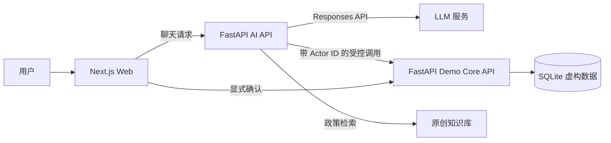
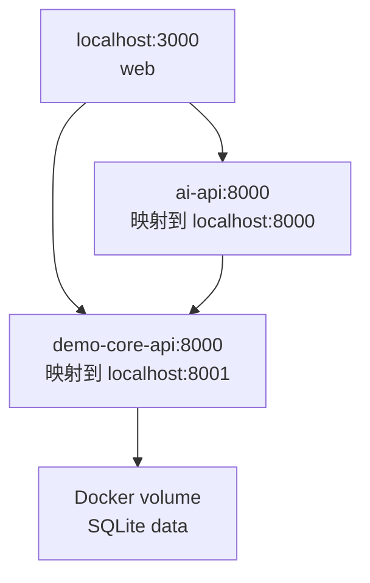

# 系统架构总览

## 设计目标

这个仓库展示一个虚构的内部工时助手如何在使用大模型的同时保留确定性的权限和写操作边界。大模型负责理解语言和组织回答，应用服务负责决定哪些数据可以读取、哪些动作可以执行。

系统只包含原创的 AcmeWorks 演示数据，不连接真实员工系统。

## 组件关系

LLM 服务是可选运行依赖。没有配置模型密钥时，AI API 使用明确标记的本地降级模式；Web、Core API 和演示数据仍可独立运行。

## 各组件职责

### Next.js Web

- 展示聊天、工具事件、统计图表和政策引用。
- 通过 SSE 实时展示规划、受控工具执行和回答生成阶段。
- 展示由 Core API 确定性生成的角色范围周报和 CSV 下载。
- 允许切换三个固定演示身份。
- 保存当前会话 ID，以支持同一浏览器会话内的追问。
- 将聊天和确认请求通过服务端 Route Handler 转发，避免浏览器直接拼接内部服务地址。
- 只有用户点击确认卡片上的按钮，才会发送 `confirm: true`。

Web 不是授权边界。即使绕过页面直接请求后端，Core API 仍会重新检查身份、数据范围和动作状态。

### AI API

- 为每个请求重新读取可信的角色、部门、项目和近期工时上下文。
- 使用 LLM 或本地降级规划一个结构化意图。
- 通过固定注册表调用受控工具，不允许模型生成任意函数名或代码。
- 执行原创政策知识库检索，并返回结构化引用。
- 返回基于本人近期虚构工时的只读填报建议。
- 只为单条或最多 10 条工时草稿、以及精确记录的批准或驳回创建 dry-run，
  不直接确认写入。
- 使用授权后的执行结果生成自然语言回答。
- 在独立 SQLite 中保存有上限、有过期时间、绑定演示身份的短会话历史。
- 提供可查看、dry-run、确认和删除的最小用户偏好。

### Demo Core API

- 是员工、部门、项目、项目成员、工时和审批记录的事实来源。
- 从 SQLite 读取自动初始化的 AcmeWorks 虚构数据。
- 根据 `employee`、`manager`、`admin` 角色执行记录级过滤。
- 创建有时效、绑定操作者、只能使用一次的确认 token。
- 在真正写入前再次校验权限和业务状态。
- 批量确认在一个事务中完成，任何一项失败都会回滚整个批次。
- 为成功写操作保存审计记录。

### 知识库

- 只包含本仓库原创的虚构政策 Markdown。
- 按章节切分并在进程内建立轻量索引。
- 检索证据不足时返回明确拒绝，而不是让模型补全政策事实。
- 引用包含来源 ID、标题、章节、仓库路径和支持片段。

## 部署拓扑

本地 `docker-compose.yml` 启动三个容器：

AI API 使用容器网络名访问 Core API。SQLite 数据放在 Docker volume 中，因此普通容器重建不会自动清除已经确认的演示写入。

## 当前限制

这些限制是有意保留的演示边界：

- `X-Actor-ID` 只是固定演示身份选择，不是生产认证。生产环境需要 SSO、JWT 或网关身份。
- AI 状态使用单机 SQLite，普通容器重启可保留，但仍不适合多副本并发部署。
- SQLite 适合单机演示，不承担生产并发、迁移和高可用需求。
- 政策检索是本地轻量实现，不包含外部向量数据库或内容发布工作流。
- 审批对话必须包含精确记录 ID 和明确决定；自然语言不能批量审批，也不能
  绕过独立确认按钮。
- 没有长期用户画像、跨会话记忆、后台任务或真实通知集成。

如果向生产方向演进，应优先补充真实身份、PostgreSQL 状态存储、迁移管理、集中式可观测性和正式的数据保留策略，而不是先扩大模型权限。
